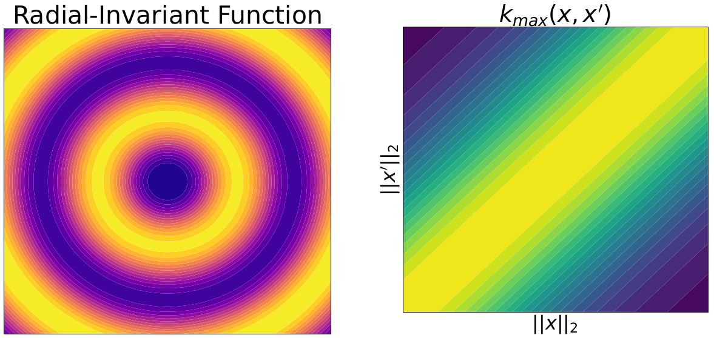

# An Off-the-Shelf Kernel for Encoding Invariance in Bayesian Optimization



## TL;DR

This repository contains the implementation (based on [BoTorch](https://botorch.org) [1]) of a kernel that can be used off-the-shelf for the Bayesian Optimization (BO) of a black-box function $f : \mathcal{S} \subset \mathbb{R}^d \to \mathbb{R}$ that exhibits invariance under the action of a group $\mathcal{G}$, i.e., for any $\mathbf{x} \in \mathcal{S}$ and any $g \in \mathcal{G}$,

$$
f(\mathbf{x}) = f(g(\mathbf{x})).
$$

To encode this information into the surrogate Gaussian Process (GP), this implementation builds a covariance function $k_\mathcal{G}$ that is invariant under the group of symmetries $\mathcal{G}$, given a base kernel $k$, defined as

$$
k_\mathcal{G}(\mathbf{x}, \mathbf{x}') = \max_{g, g' \in \mathcal{G}} k(g(\mathbf{x}), g'(\mathbf{x}')).
$$

In practice, since $k_\mathcal{G}$ is not necessarily positive semi-definite (PSD), the implementation projects the covariance matrices built from $k_\mathcal{G}$ onto the cone of PSD matrices and uses a Nyström extension [2] to construct a PSD covariance function (and thus an interpretable surrogate GP).

For more details, please see [this ICLR'26 paper](https://openreview.net/forum?id=zUbBaWAM1Q) by [Anthony Bardou](https://abardou.github.io), [Antoine Gonon](https://agonon.github.io/), [Aryan Ahadinia](https://scholar.google.com/citations?user=C5-a0JIAAAAJ&hl=en) and [Patrick Thiran](https://people.epfl.ch/patrick.thiran?lang=en).

## Contents

- [Citing this Work](#citing-this-work)
- [Installation](#installation)
- [Quick Start](#quick-start)
- [References](#references)

## Citing this Work

If you use this code or if you'd like to reference this work, please cite [the following paper](https://openreview.net/forum?id=zUbBaWAM1Q) [3] with the following BibTeX entry:

```bibtex
@article{bardou2025symmetry,
  title={Symmetry-Aware Bayesian Optimization via Max Kernels},
  author={Bardou, Anthony and Gonon, Antoine and Ahadinia, Aryan and Thiran, Patrick},
  journal={arXiv preprint arXiv:2509.25051},
  year={2025}
}
```

The BibTeX entry will be updated as soon as the paper appears in ICLR'26 proceedings.

## Installation

To use this kernel, just download the code from this repository and unzip it.

All the required packages are listed in `requirements.txt`. To install them, open your favorite command line and run
```
pip install -r requirements.txt
```

## Quick Start

A minimal working example with a discrete group of symmetries is provided in `mwe.py` to illustrate how this kernel can be used to optimize an invariant objective function.

## References

[1] Balandat, M., Karrer, B., Jiang, D., Daulton, S., Letham, B., Wilson, A. G., & Bakshy, E. (2020). BoTorch: A framework for efficient Monte-Carlo Bayesian optimization. Advances in neural information processing systems, 33, 21524-21538.

[2] Williams, C., & Seeger, M. (2000). Using the Nyström method to speed up kernel machines. Advances in neural information processing systems, 13.

[3] Bardou, A., Gonon, A., Ahadinia, A., & Thiran, P. (2026). Symmetry-Aware Bayesian Optimization via Max Kernels. ICLR'26.